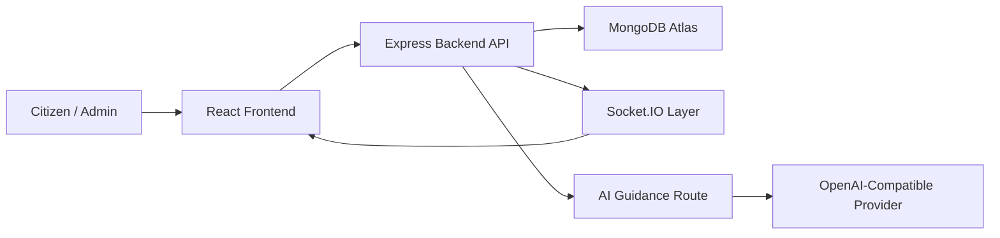
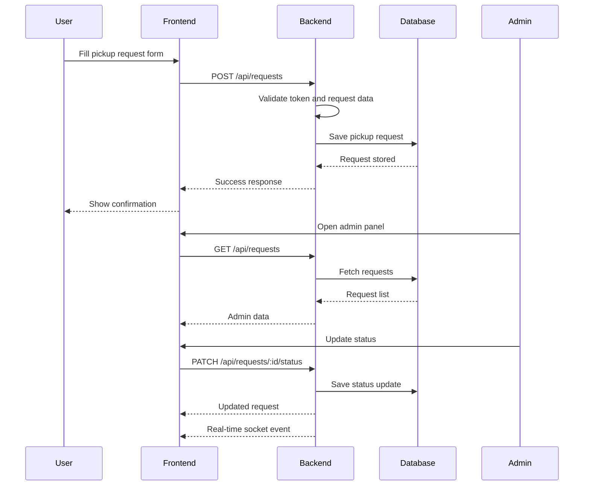

# EcoSphere Smart Waste Portal


EcoSphere Smart Waste Portal is a full-stack web application built to simplify waste pickup management, recycling education, admin-side monitoring, and AI-guided sustainability support through a modern digital platform.

It is designed like a real civic-tech product where:

- citizens can request waste pickup online
- users can track request status in real time
- admins can manage requests and users
- the platform can guide users with AI-powered recycling suggestions

This project combines a polished React frontend with an Express, Socket.IO, and MongoDB-ready backend to create a practical, real-world solution for smart waste management.

---

## Table of Contents

1. [Project Overview](#project-overview)
2. [Problem Statement](#problem-statement)
3. [Project Objectives](#project-objectives)
4. [Core Features](#core-features)
5. [Tech Stack](#tech-stack)
6. [Preview Section](#preview-section)
7. [Screenshot Gallery](#screenshot-gallery)
8. [System Architecture](#system-architecture)
9. [Architecture Diagram](#architecture-diagram)
10. [Project Flow](#project-flow)
11. [Frontend and Backend Flow](#frontend-and-backend-flow)
12. [Frontend Modules](#frontend-modules)
13. [Backend Modules](#backend-modules)
14. [Database Design](#database-design)
15. [API Summary](#api-summary)
16. [Folder Structure](#folder-structure)
17. [Environment Variables](#environment-variables)
18. [Local Setup](#local-setup)
19. [Running the Project](#running-the-project)
20. [Demo Accounts](#demo-accounts)
21. [Deployment Guide](#deployment-guide)
22. [Testing and Verification](#testing-and-verification)
23. [Topics](#topics)
24. [Troubleshooting](#troubleshooting)
25. [Future Scope](#future-scope)
26. [Learning Outcomes](#learning-outcomes)
27. [Project Links](#project-links)
28. [License](#license)

---

## Project Overview

EcoSphere Smart Waste Portal is a smart waste management platform that helps users schedule waste pickup, learn proper disposal practices, and receive recycling guidance through a clean and responsive interface.

The system includes both citizen-side and admin-side features:

- the citizen side focuses on pickup requests, request tracking, and education
- the admin side focuses on managing requests, updating statuses, and monitoring user activity

The project is suitable for:

- academic submission
- portfolio presentation
- full-stack practice
- civic-tech themed demonstrations

---

## Problem Statement

Traditional waste collection methods are often unorganized, hard to track, and slow to manage. Citizens usually have no easy way to know:

- how to request pickup
- when their request will be handled
- how to separate waste correctly
- where to get correct recycling information

At the same time, administrators need a better system to:

- manage pickup workflows
- update status quickly
- monitor user requests
- reduce confusion in communication

This project solves that gap by creating a digital platform for waste pickup and recycling support.

---

## Project Objectives

The main objectives of this project are:

- to digitize the waste pickup request process
- to allow users to track request progress
- to provide a responsive and user-friendly interface
- to give admins better control over operations
- to support real-time updates
- to encourage sustainability and recycling awareness
- to integrate AI guidance for better waste disposal decisions

---

## Core Features

### Citizen Features

- signup and login
- secure authentication
- dashboard with request stats
- waste pickup request form
- waste category selection
- optional image upload
- live location support
- request history and tracking
- AI recycling assistant
- recycling education section

### Admin Features

- view all pickup requests
- update request status
- manage workflow between pending, in progress, and completed
- view registered users
- monitor user activity and request insights
- separate request and user management sections

### Smart Features

- real-time request updates using Socket.IO
- AI recycling suggestions
- dark mode and light mode
- mobile responsive layout
- map preview for live location

---

## Tech Stack

### Frontend

- React.js
- TypeScript
- Vite
- Tailwind CSS
- Framer Motion
- Three.js
- Recharts
- Lucide React
- Socket.IO Client

### Backend

- Node.js
- Express.js
- TypeScript
- Socket.IO
- Zod

### Database

- MongoDB Atlas
- Mongoose

### Authentication and Security

- JWT
- bcryptjs
- Helmet
- express-rate-limit
- CORS

### AI and Utilities

- OpenAI SDK
- OpenAI-compatible provider support
- Multer

### Deployment

- Vercel for frontend
- Render or Railway for backend
- MongoDB Atlas for cloud database

---

## Preview Section

### Live Demo

**Production URL:**  
[https://ecosphere-smart-waste-portal.vercel.app](https://ecosphere-smart-waste-portal.vercel.app)

### Demo Highlights

- modern landing page with civic-tech style interface
- secure authentication system
- user dashboard with request overview
- pickup request workflow with live location
- AI recycling guidance
- admin-side request and user management
- responsive desktop and mobile experience

### Suggested Demo GIF / Video Assets

If you want to make this README even more premium later, you can add short recordings such as:

- landing page walkthrough
- pickup request submission demo
- admin workflow demo
- AI guide interaction demo

Suggested asset names:

```text
docs/demo/homepage-demo.gif
docs/demo/request-workflow.gif
docs/demo/admin-workflow.gif
docs/demo/ai-guide-demo.gif
```

---

## Screenshot Gallery

Below is a suggested screenshot plan for academic evaluation, portfolio use, and GitHub presentation.

### Recommended Screenshots

| Section | What to Capture | Suggested File Name |
|---|---|---|
| Landing Page | Hero section, navigation, product feel | `landing-page.png` |
| Authentication | Login or signup UI | `auth-page.png` |
| User Dashboard | Charts, stats, recent activity | `dashboard-page.png` |
| Pickup Form | Request form with map preview | `pickup-request-page.png` |
| AI Guide | Chat or recycling assistant screen | `ai-guide-page.png` |
| Recycling Education | Learning page content | `recycling-page.png` |
| Admin Requests | Admin request management tab | `admin-requests.png` |
| Admin Users | Admin users overview tab | `admin-users.png` |
| Mobile UI | Mobile responsive layout | `mobile-view.png` |

### Suggested Screenshot Folder

```text
docs/
\-- screenshots/
    |-- landing-page.png
    |-- auth-page.png
    |-- dashboard-page.png
    |-- pickup-request-page.png
    |-- ai-guide-page.png
    |-- recycling-page.png
    |-- admin-requests.png
    |-- admin-users.png
    \-- mobile-view.png
```

### Ready Markdown for Future Use

```md
## Screenshots

### Landing Page


### Dashboard


### Pickup Request


### Admin Requests

```

---

## System Architecture

The project follows a separated frontend-backend architecture.

### High-Level Architecture

```text
User -> React Frontend -> Express API -> MongoDB Atlas
                         -> Socket.IO -> Real-time updates
                         -> AI Route -> Recycling guidance
```

### Layer Responsibilities

- **Frontend**: UI, form handling, route protection, charts, responsive views
- **Backend**: authentication, validation, business logic, data access, AI integration
- **Database**: users, requests, notifications
- **Real-Time Layer**: request creation and status update events

---

## Architecture Diagram



### Architecture Summary

- the frontend handles UI, forms, dashboards, and protected navigation
- the backend handles validation, authentication, business logic, and API routing
- MongoDB Atlas stores users, requests, and notifications
- Socket.IO enables real-time request activity
- AI guidance route processes sustainability-related questions securely on the server side

---

## Project Flow

### Normal User Flow

1. User signs up or logs in
2. User lands on dashboard
3. User opens request page
4. User fills waste details and submits pickup request
5. Backend validates and stores request
6. Admin views request in admin panel
7. Admin updates request status
8. User receives updated request information

### Admin Flow

1. Admin logs in
2. Admin opens admin panel
3. Admin switches between `Requests` and `Users`
4. Admin monitors waste requests
5. Admin updates request statuses
6. System reflects changes in user-facing data

### AI Guidance Flow

1. User opens AI Guide
2. User asks recycling-related question
3. Frontend sends prompt to backend AI route
4. Backend calls AI provider securely
5. User receives sustainability guidance

---

## Frontend and Backend Flow

### End-to-End Request Flow



### Frontend Responsibilities

- collecting user input
- rendering request and dashboard data
- handling routing and protected views
- storing auth session
- showing validation and feedback messages

### Backend Responsibilities

- authentication and authorization
- validation middleware
- request creation and updates
- data persistence
- notification logic
- AI integration
- real-time communication

---

## Frontend Modules

### 1. Landing Page

- project introduction
- modern hero section
- navigation
- first impression for the platform

### 2. Authentication Page

- login and signup
- secure token-based session handling
- clean user onboarding

### 3. Dashboard Page

- personal request summary
- request statistics
- charts and recent request activity

### 4. Request Pickup Page

- waste type selection
- quantity input
- pickup date selection
- address input
- live location support
- optional notes
- optional photo upload

### 5. AI Guide Page

- chat-like interface
- AI-driven recycling suggestions
- sustainability support

### 6. Recycling Education Page

- educational content
- guidance on good disposal practices

### 7. Admin Page

- request management
- user overview
- status update workflow
- mobile-friendly admin status actions

### 8. Profile Page

- user details
- simple account summary

---

## Backend Modules

### 1. Authentication Routes

Used for:

- signup
- login
- token-based access

### 2. Request Routes

Used for:

- create waste pickup request
- fetch requests
- fetch admin request list
- update request status
- fetch stats summary

### 3. AI Routes

Used for:

- recycling advice
- sustainability questions

### 4. Location Routes

Used for:

- reverse geocoding
- converting latitude/longitude to readable address

### 5. Notification Routes

Used for:

- returning user notifications

### 6. Middleware

- validation middleware
- auth middleware
- role protection
- error handling
- not found handling

### 7. Socket Layer

Used for:

- request created events
- request updated events
- user room and admin room communication

---

## Database Design

The application is MongoDB Atlas ready.

### Collections

#### 1. Users

Stores:

- id
- name
- email
- passwordHash
- role
- createdAt

#### 2. Pickup Requests

Stores:

- id
- userId
- userName
- wasteType
- quantityKg
- address
- pickupDate
- notes
- imageUrl
- status
- createdAt
- updatedAt

#### 3. Notifications

Stores:

- id
- userId
- title
- message
- read
- createdAt

### Storage Notes

- if `MONGODB_URI` is configured, MongoDB Atlas is used
- if not configured, the app can fall back to local JSON data for demo purposes

---

## API Summary

### Auth Routes

- `POST /api/auth/signup`
- `POST /api/auth/login`

### Request Routes

- `GET /api/requests`
- `POST /api/requests`
- `PATCH /api/requests/:id/status`
- `GET /api/requests/stats/summary`

### AI Routes

- `POST /api/ai/recycling-advice`

### Location Routes

- `GET /api/location/reverse-geocode`

### Notification Routes

- `GET /api/notifications`

### Utility Route

- `GET /health`

---

## Folder Structure

```text
ecosphere-smart-waste-portal/
|-- package.json
|-- package-lock.json
|-- README.md
|-- LICENSE
|-- netlify.toml
|-- render.yaml
|-- backend/
|   |-- package.json
|   |-- tsconfig.json
|   |-- .env.example
|   `-- src/
|       |-- config.ts
|       |-- server.ts
|       |-- types.ts
|       |-- db/
|       |-- data/
|       |-- middleware/
|       |-- models/
|       |-- routes/
|       |-- socket/
|       `-- utils/
`-- frontend/
    |-- package.json
    |-- vite.config.ts
    |-- vercel.json
    |-- .env.example
    |-- public/
    `-- src/
        |-- components/
        |-- context/
        |-- hooks/
        |-- lib/
        |-- pages/
        `-- types/
```

---

## Environment Variables

### Backend `.env`

Create `backend/.env` from [backend/.env.example](C:/Users/ASUS/Documents/Codex/2026-04-19-act-as-a-senior-full-stack/backend/.env.example)

```env
PORT=5000
CLIENT_URL=http://localhost:5173
JWT_SECRET=use-a-long-random-secret
MONGODB_URI=
MONGODB_DB_NAME=ecosphere-smart-waste
OPENAI_API_KEY=
OPENAI_BASE_URL=
OPENAI_MODEL=gpt-4.1-mini
```

### Groq / OpenAI-Compatible Setup

```env
OPENAI_API_KEY=your-groq-key
OPENAI_BASE_URL=https://api.groq.com/openai/v1
OPENAI_MODEL=llama-3.3-70b-versatile
```

### Frontend `.env`

Create `frontend/.env` only if needed:

```env
VITE_API_URL=http://localhost:5000
VITE_SOCKET_URL=http://localhost:5000
```

For local development, Vite proxy support can be used depending on configuration.

---

## Local Setup

### 1. Install Node.js

Install Node.js version 20 or above from [nodejs.org](https://nodejs.org/).

### 2. Install dependencies

From the root:

```bash
npm install
```

Then install project dependencies if needed in each app:

```bash
cd backend
npm install

cd ../frontend
npm install
```

### 3. Configure backend environment

Create `backend/.env` and add the required values.

### 4. Configure frontend environment if needed

Create `frontend/.env` only when deploying or when you want fixed API URLs.

---

## Running the Project

### Start Backend

```bash
cd backend
npm run dev
```

### Start Frontend

```bash
cd frontend
npm run dev
```

### Default Local URLs

- Frontend: `http://localhost:5173`
- Backend: `http://localhost:5000`
- Health API: `http://localhost:5000/health`

---

## Demo Accounts

```text
Admin
Email: admin@smartwaste.local
Password: password

Citizen
Email: asha@example.com
Password: password
```

---

## Deployment Guide

## Frontend on Vercel

Use the `frontend` folder as root.

### Settings

- Framework preset: `Vite`
- Root directory: `frontend`
- Build command: `npm run build`
- Output directory: `dist`

### Frontend Environment Variables

```env
VITE_API_URL=https://your-backend-url.onrender.com
VITE_SOCKET_URL=https://your-backend-url.onrender.com
```

Repository already contains:

- [frontend/vercel.json](C:/Users/ASUS/Documents/Codex/2026-04-19-act-as-a-senior-full-stack/frontend/vercel.json)

---

## Frontend on Netlify

Repository already contains:

- [netlify.toml](C:/Users/ASUS/Documents/Codex/2026-04-19-act-as-a-senior-full-stack/netlify.toml)
- [frontend/public/_redirects](C:/Users/ASUS/Documents/Codex/2026-04-19-act-as-a-senior-full-stack/frontend/public/_redirects)

### Settings

- Base directory: `frontend`
- Build command: `npm run build`
- Publish directory: `dist`

---

## Backend on Render

Use `backend` as service root.

### Backend Environment Variables

```env
PORT=5000
CLIENT_URL=https://your-frontend-url.vercel.app
JWT_SECRET=your-production-secret
MONGODB_URI=your-mongodb-atlas-connection-string
MONGODB_DB_NAME=ecosphere-smart-waste
OPENAI_API_KEY=your-provider-key
OPENAI_BASE_URL=https://api.groq.com/openai/v1
OPENAI_MODEL=llama-3.3-70b-versatile
```

### Build and Start

```bash
npm install && npm run build
npm run start
```

Repository already contains:

- [render.yaml](C:/Users/ASUS/Documents/Codex/2026-04-19-act-as-a-senior-full-stack/render.yaml)

---

## Backend on Railway

Use `backend` as root and configure the same environment variables as Render.

### Build and Start

```bash
npm install && npm run build
npm run start
```

---

## Testing and Verification

You can verify the project using:

### Manual Testing

- signup with a new account
- login with existing account
- submit pickup request
- check dashboard stats
- open admin panel
- update request status
- test AI guidance
- test mobile responsiveness

### Build Testing

```bash
npm run build --prefix backend
npm run build --prefix frontend
```

### Health Check

```bash
GET /health
```

Expected response:

```json
{
  "status": "ok",
  "service": "smart-waste-backend"
}
```

---

## Topics

```text
react
typescript
vite
express
socket-io
tailwindcss
openai
smart-city
recycling
sustainability
dashboard
full-stack
mongodb
render
vercel
```

---

## Troubleshooting

### 1. Login or Signup Feels Slow

Possible reason:

- free-tier backend cold start

Fix:

- wait a few seconds for first request
- keep backend warm with active usage

### 2. Token Missing or Session Expired

Fix:

- login again
- ensure local storage is not cleared
- check backend auth token route behavior

### 3. Validation Failed on Request Page

Fix:

- enter complete address
- select pickup date
- ensure quantity is between 1 and 500

### 4. Old Data Not Showing

Fix:

- verify MongoDB Atlas connection in backend env
- check `MONGODB_URI`
- check `MONGODB_DB_NAME`

### 5. Requests Not Persisting

Fix:

- confirm Atlas is connected
- check Render logs for `MongoDB connected.`

### 6. Admin Mobile Status Update Not Working

Fix already applied:

- direct mobile status action buttons added

---

## Future Scope

- drag-and-drop map pin selection
- push notifications
- file upload to cloud storage
- image-based waste classification
- advanced analytics for admin dashboard
- audit logs
- multilingual support
- stronger notification center
- route optimization suggestions for collection teams
- citizen reward system for proper recycling behavior

---

## Learning Outcomes

Through this project, the following concepts were practiced:

- frontend-backend integration
- TypeScript-based React development
- Node.js API development
- JWT authentication
- password hashing
- MongoDB Atlas integration
- role-based access control
- input validation
- real-time updates using Socket.IO
- deployment on modern cloud platforms
- project debugging and production troubleshooting

---

## Project Links

### GitHub Repository

`https://github.com/rishii-005/ecosphere-smart-waste-portal`

### Live Frontend

`https://ecosphere-smart-waste-portal.vercel.app`

---

## License

This project is released under the MIT License.

See [LICENSE](C:/Users/ASUS/Documents/Codex/2026-04-19-act-as-a-senior-full-stack/LICENSE).
